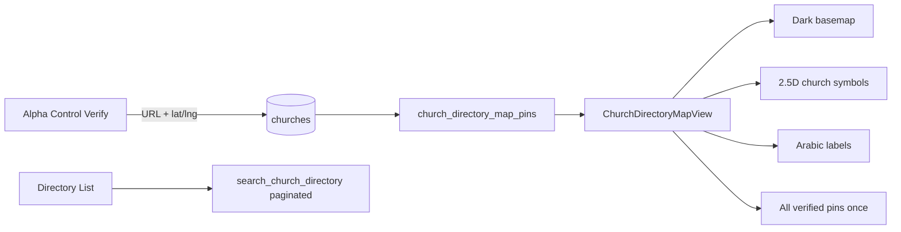

# Church Directory Map — Verified-Only 3D Vision Plan

**Date:** 2026-06-24  
**Scope:** Plan only (user requested review before implementation)

---

## Executive Summary

The Church Directory map today uses **MapLibre + light tiles + purple circle pins**, shows **paginated list rows** (not all churches), and does **not** require Alpha Control verification. Verified admin flow saves URL flags but **does not write lat/lng** from the approved Maps link. A phased plan is recommended: fix data truth first, then premium 2.5D markers + dark map (reference-like), optional real 3D later.

---

## Current State

| Area | Today |
|------|--------|
| Map | MapLibre GL, Carto **light** raster |
| Markers | Clustered **circles** (purple/gold) |
| Churches on map | Paginated search rows (~20/page), any active church |
| Verified filter | Optional pill; **not default on map** |
| Coords | `latitude` / `longitude` (directory); verify RPC does **not** set them |
| Alpha Control verify | `location_verified`, `verified_location_url`, `is_verified` |
| 3D | Not implemented; unused CSS pin classes |

**Reference image target:** Dark terrain map, glowing network lines, **isometric 3D church building** at pin, floating cross badge, Arabic name label, category legend, gold/purple DNA.

---

## Findings (Gaps)

1. **Verified-only:** Map can show unverified churches unless user taps "موثّقة".
2. **Exact location:** Verify does not extract/store coordinates from approved Google Maps URL.
3. **Column split:** Setup may write `location_lat`/`location_lng` while map reads `latitude`/`longitude`.
4. **Incomplete map data:** Map uses list pagination — not all verified pins load.
5. **Visual gap:** Circles vs reference 3D church models — large UX jump.

---

## Recommended Vision (3 Phases)

### Phase 1 — Data truth (must do first) ⭐

**Goal:** Map shows only churches Alpha Control approved, at correct coordinates.

| Task | Detail |
|------|--------|
| RPC `church_directory_map_pins` | `location_verified = true`, `latitude/longitude NOT NULL`, return id, name, city, lat, lng, type |
| Verify RPC upgrade | On verify: parse lat/lng from `verified_location_url` / Google Maps URL → write `latitude`, `longitude` |
| Column unify | `latitude = coalesce(latitude, location_lat)` in view or one-time migration |
| Backfill script | Geocode existing verified URLs missing coords (reuse `scripts/geocode-churches.mjs` pattern) |
| Map query | Dedicated hook — load **all** map pins (no pagination) |
| Map default | **Verified-only** on map view; list can stay broader with filter |

**Why first:** Without this, 3D pins on wrong/missing coords hurt trust (priest/researcher use case).

---

### Phase 2 — Reference look (recommended deliverable) ⭐

**Goal:** ~85–90% visual match to reference without heavy WebGL 3D.

| Element | Approach |
|---------|----------|
| Basemap | Carto **Dark Matter** or custom dark style + subtle gold network lines (optional GeoJSON) |
| Church marker | **Layered symbol/HTML marker:** isometric church **WebP/PNG** (2.5D) + gold halo + cross pin above |
| Selected | Larger scale + stronger glow (like St. George centerpiece in reference) |
| Label | Arabic name + city under marker (`symbol` layer or DOM marker) |
| Categories | If `church_type` exists: church / monastery / service house — tint base or icon |
| Cluster | Gold/purple cluster bubble matching Alpha DNA (not plain circles) |
| Controls | Bottom legend + locate / filter chips like reference |

**Why not full 3D yet:** True GLB models per church in MapLibre need Three.js custom layer, asset pipeline, performance tuning, and Mapbox-tier polish. **Premium 2.5D sprite** matches reference at fraction of cost and works on mobile.

---

### Phase 3 — Real 3D (optional premium)

- MapLibre custom layer + shared GLB church model(s) with scale by zoom
- Or Mapbox Standard / Google Maps 3D (API keys, billing)
- Globe + terrain for “fly to church” moments
- **Only after** Phase 1–2 validated with users

---

## Architecture Sketch



---

## Warnings

1. **Sparse map initially:** ~19 verified churches (per last audit) — map will look empty until Alpha Control verifies more.
2. **Google URL parsing:** Some Maps URLs need place-id resolution; may need server-side geocode fallback.
3. **Symbol glyphs:** Current cluster count layer may fail without `glyphs` in style — fix when switching to symbol markers.
4. **Performance:** DOM markers for 500+ churches need clustering; stay on GeoJSON + symbol layers where possible.

---

## Errors

None (planning document).

---

## Recommendations

| Priority | Action |
|----------|--------|
| P0 | Phase 1 — verified-only map pins + coord on verify |
| P1 | Phase 2 — dark map + 2.5D church marker asset (match reference) |
| P2 | Arabic labels + legend bar |
| P3 | Phase 3 real 3D if product asks after Phase 2 |

**Suggested start:** Phase 1 + Phase 2 core (dark map, 2.5D marker, verified-only query). User approval before coding.

---

## Overall Status

**PLAN READY — awaiting user go-ahead**

---

## COPYABLE REPORT

```
CHURCH MAP 3D PLAN — 2026-06-24 | PLAN
Phase 1: verified-only pins + lat/lng from Alpha Control verify
Phase 2: dark map + 2.5D church sprite (reference-like)
Phase 3: optional real GLB 3D
Current: MapLibre circles, paginated, no coord on verify
Recommend: start Phase 1+2 after approval
```
